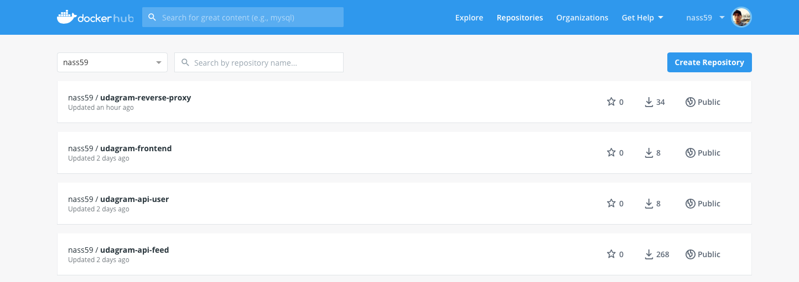
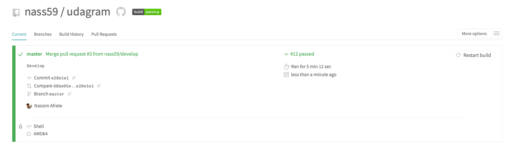
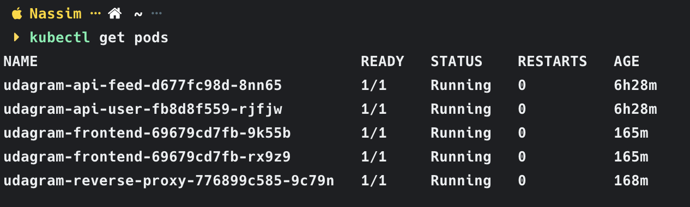
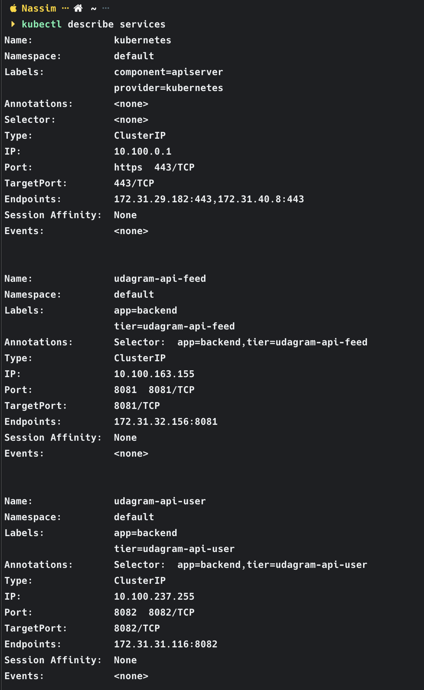
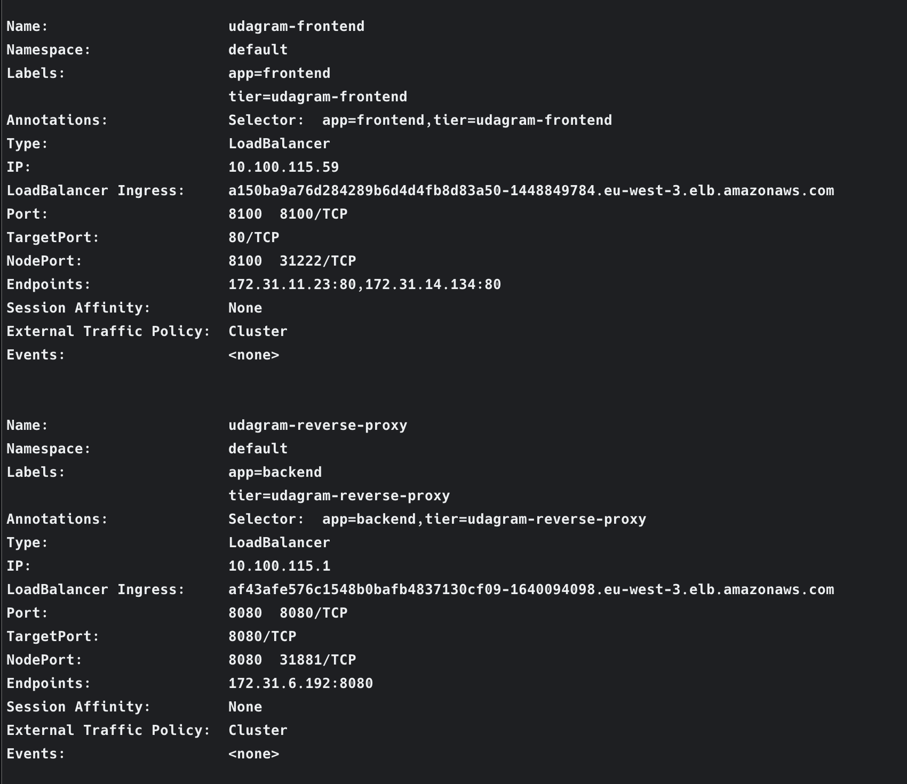
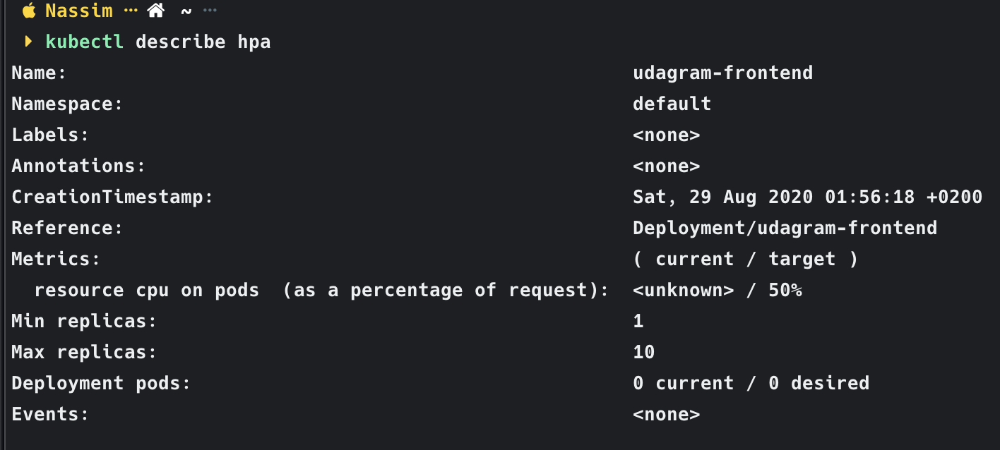
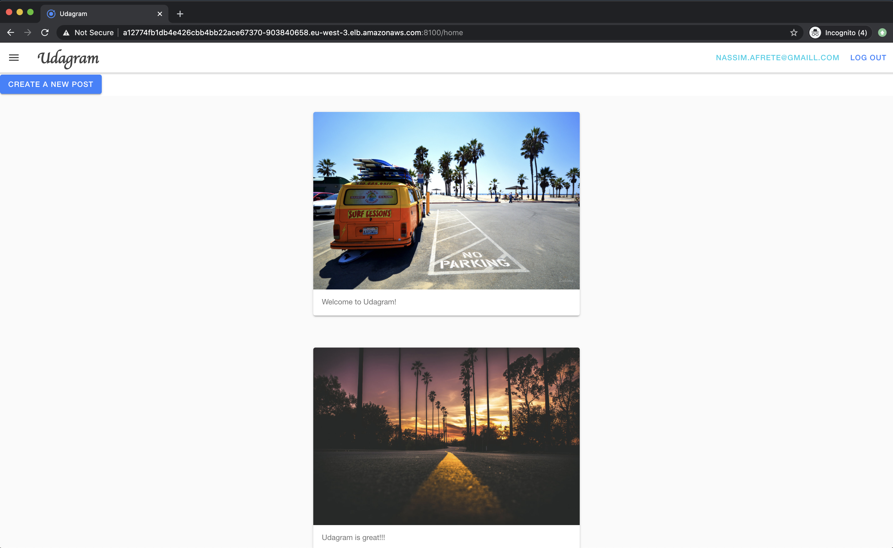
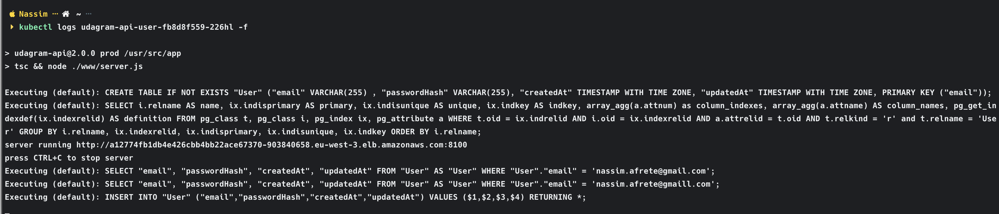

# Udagram Image Filtering Application

Udagram is a simple cloud application developed alongside the Udacity Cloud Engineering Nanodegree. It allows users to register and log into a web client, post photos to the feed, and process photos using an image filtering microservice.

The project is split into two parts:

1. Frontend - Angular web application built with Ionic Framework
2. Backend RESTful API - Node-Express application

## Getting Started

### Prerequisite

To run the application you will need:

- [Docker](https://www.docker.com/products/docker-desktop)
- [AWS CLI](https://aws.amazon.com/cli/)
- [Kubectl](https://kubernetes.io/docs/tasks/tools/install-kubectl/)
- An [AWS](https://console.aws.amazon.com) account
- A [Docker Hub](https://hub.docker.com/) account

#### Amazon Web Services (AWS)

The application uses the following services:

- [S3 Bucket](https://docs.aws.amazon.com/s3/index.html) to store images
- [RDS](https://eu-west-3.console.aws.amazon.com/rds/home?region=eu-west-3#GettingStarted:) with a PostgreSQL Database
- [Elastic Kubernetes Service](https://eu-west-3.console.aws.amazon.com/eks/home) (Amazon EKS) to orchestrate our containers

### Clone the repository

Clone the repository on your local machine:

```
git clone git@github.com:nass59/udagram.git
```

Once installed you will have to set your environment variables in `udagram-api-feed` and `udagram-api-user`

```
cp udagram-api-feed/.env.dist udagram-api-feed/.env
cp udagram-api-user/.env.dist udagram-api-user/.env
```

#### Environment Script

A file named [set_env.sh](https://github.com/udacity/nd9990-c3-microservices-exercises/blob/master/project/set_env.sh) can be used to help you configure these variables on your local development environment.

### Database

Create a PostgreSQL database either locally or on AWS RDS. Set the config values for environment variables prefixed with `POSTGRES_` in `set_env.sh`.

### S3

Create an AWS S3 bucket. Set the config values for environment variables prefixed with `AWS_` in `set_env.sh`.

Add this following configuration for CORS

```
<?xml version="1.0" encoding="UTF-8"?>
<CORSConfiguration xmlns="http://s3.amazonaws.com/doc/2006-03-01/">
<CORSRule>
    <AllowedOrigin>*</AllowedOrigin>
    <AllowedMethod>POST</AllowedMethod>
    <AllowedMethod>GET</AllowedMethod>
    <AllowedMethod>PUT</AllowedMethod>
    <AllowedMethod>DELETE</AllowedMethod>
    <AllowedMethod>HEAD</AllowedMethod>
    <AllowedHeader>*</AllowedHeader>
</CORSRule>
</CORSConfiguration>
```

### Run the application

> _tip_: You can run application from this parent directtory or from each projects.

1. Build Docker images:

```bash
make build-images
```

2. Run Docker images:

```bash
make run
```

3. You can visit `http://localhost:8100` in your web browser to verify that the application is running.

### Docker Hub

You can push images to the Docker Hub

```bash
make push-images
```

You will have the following results on your Docker Hub



### Travis

The project uses [Travis](https://travis-ci.org/) as CI/CD tool.



### Kubernetes

The project uses [Kubernetes](https://kubernetes.io/) as a CD Tool to orchestrate our docker containers.

Before deploying on k8s you will have to set secrets variables. You can run:

```bash
make k8s-set-env // Set Env Variables
make k8s-env     // Add Env Variables to k8s
```

Now you can deploy on k8s using the command:

```bash
make k8s-deploy
```

Once deployed you can check if everything is correct by running the following commands:

- `kubectl get pods`



- `kubectl get services`




- `kubectl describe hpa`

> _tip_: You can enable autoscale by running the command `make k8s-autoscale` on the project you want.



If everything looks good, you should be able to use the application on your browser. You can go to `http://localhost:8100` or to your EKS Endpoint (Load Balancer).



### Monitoring / Logs

To check that the backend API pod logs user activity that is logged when an API call is made you can run the command:

```bash
kubectl log YOUR_USER_API_POD -f
```



## Tips

1. It's useful to "lint" your code so that changes in the codebase adhere to a coding standard. This helps alleviate issues when developers use different styles of coding. `eslint` has been set up for TypeScript in the codebase for you. To lint your code, run the following:

   ```bash
   npx eslint --ext .js,.ts src/
   ```

   To have your code fixed automatically, run

   ```bash
   npx eslint --ext .js,.ts src/ --fix
   ```

2. Over time, our code will become outdated and inevitably run into security vulnerabilities. To address them, you can run:

   ```bash
   npm audit fix
   ```
